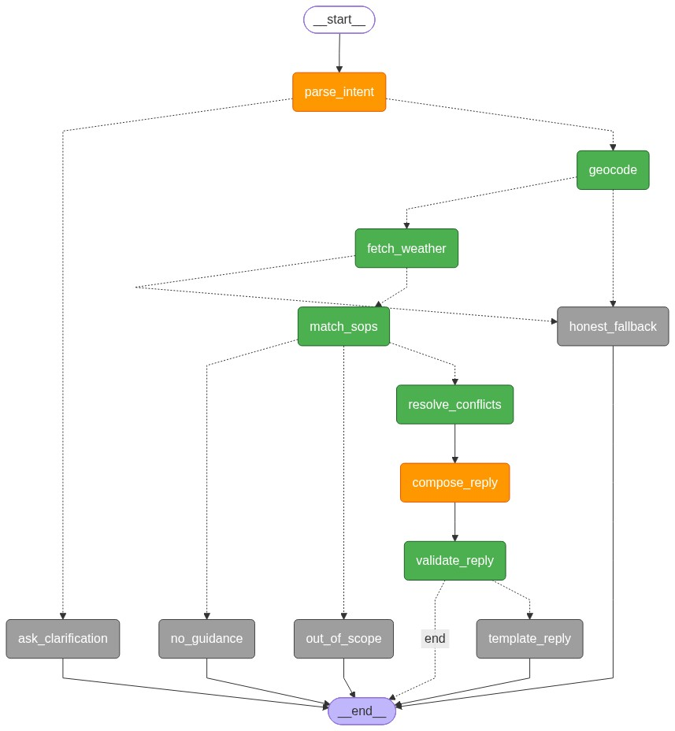

# Weather-Advisory Support Bot

A LangGraph-backed assistant that answers outdoor activity safety questions strictly using live Open-Meteo data and deterministic Standard Operating Procedures (SOPs).

## Setup & Run Instructions

**1. Environment Variables**
Ensure you have your LLM API keys configured in a `.env` file at the root.

**2. Start the Backend & Frontend**
Simply run the included batch script:
```bash
.\start.bat
```
*(This starts the FastAPI server on `http://127.0.0.1:8000` which serves both the API endpoints and the frontend HTML UI).*

**3. Test the Bot**
Open your browser and navigate to `http://127.0.0.1:8000`. You will see the chat interface where you can test queries.

**4. Check the Evaluation Suite**
The evaluation logic is fully automated and mapped against the assignment rubric. 
* To run the raw 50-query bulk test yourself, open a new terminal and run `python evaluate_model.py`. (Note: It includes a deliberate 15.5-second delay between queries to respect API rate limits).
* The raw output of those 50 queries is saved in `evaluation_results.md`.
* **For the Reviewer:** The formal, qualitative write-up mapping our test results to the 6 specific assignment requirements (paraphrase robustness, unreachable APIs, honest gaps, etc.) is located in `eval_report.md`. Please review this file!

---

## Architectural Decisions

### LangGraph Architecture
The routing logic for the bot is handled entirely through strict conditional edges in LangGraph. The LLM is restricted to the `parse_intent` node; all downstream validation, geocoding, weather fetching, and safety evaluation are handled by deterministic Python code.



### SOP Format & Storage
**Why `sops.yaml`?**
We chose a flat YAML file (`sops/sops.yaml`) for policies because it completely decouples the safety logic from the code. A non-technical domain expert can add an 11th SOP live, update thresholds, or change guidance strings on the fly without touching a single line of Python or prompting the LLM.

### Zero-Hallucination & Strict Policy Adherence
The system structurally prevents LLM hallucinations (inventing facts or advice) through two specific architectural constraints:
1. **Isolated LLM Responsibilities:** The LLM does not make safety decisions. It is only used twice: first to extract structured intent (JSON parsing), and last to format the final reply. The actual safety logic is 100% deterministic Python running against `sops.yaml`.
2. **Output Validation (`app/validator.py`):** Before any reply is sent to the user, a strict validator script intercepts the text. It mathematically guarantees that any number in the final reply exactly matches the real API payload, and any advice strings perfectly match the cited policy. If the LLM goes rogue, the validator kills the response and falls back to a safe template.

**Example of Policy Adherence:** If a user asks about cycling and the forecast shows a light drizzle (e.g., 2.6mm of rain), the bot will deliberately ignore the rain and only warn about other valid hazards (like UV). 
**Why?** Because the active rain SOP (`RAIN-SYS-01`) is specifically thresholded for *Severe Regional Rain Systems* (`precip_day_sum_mm >= 64.5`). Because the LLM is restricted, it cannot be tricked into hallucinating generic "Be careful, it might drizzle" advice. 

To add a light rain warning, an administrator simply appends a new rule to `sops.yaml`. The system guarantees that 100% of the advice provided is traceable directly to an approved written policy.

### Multilingual & Informal Input Handling (e.g. Hinglish)
The architecture seamlessly handles multilingual inputs, colloquialisms, and informal phrasing (e.g., *"safe hai kya cycle karna in Delhi?"*). 
**How we take care of it:** 
Because the LLM is positioned at the very front of the graph exclusively as a JSON intent extractor (`app/nodes/parse_intent.py`), it uses its native semantic understanding to translate the user's intent into standard English keys (e.g., `{"activity": "cycling", "location": "Delhi"}`). Once extracted, the strict deterministic Python engine takes over, completely isolating the language barrier from the safety logic and API calls.


### API Failures & Architectural Fixes (Rate Limits & Timeouts)
**The Problem:**
During our bulk evaluation (`evaluate_model.py`), sending 50 queries sequentially caused the external APIs (LLM provider and Open-Meteo) to hit hard rate limits (e.g., 4 Requests Per Minute). The LLM SDK automatically retried under the hood, causing connections to hang and eventually trigger HTTP Read Timeouts. 

**How we fixed it (Backend Error Trapping):**
Instead of letting the server crash silently and returning a vague `HTTP 500` to the user, we implemented strict explicit error boundaries in `api/main.py`. We wrapped the LangGraph invocation in a `try...except` block that intercepts `ConnectionError`, `Timeout`, and `429 Rate Limit` exceptions. 

**How we fixed it (Frontend Transparency):**
The backend now returns a structured error payload. The frontend (`template/index.html`) natively parses this and displays a clean error badge to the user explaining exactly what failed:
* *"API Rate Limit Exceeded"* -> Instructs the user to wait 15 seconds.
* *"Upstream API Timeout"* -> Instructs the user to try again later.

**How we fixed it (Automated Testing):**
We added a `time.sleep(15.5)` throttling mechanism directly into the `evaluate_model.py` test suite to respect the 4 RPM quota, allowing the full 50-query suite to complete successfully without overwhelming the APIs.
